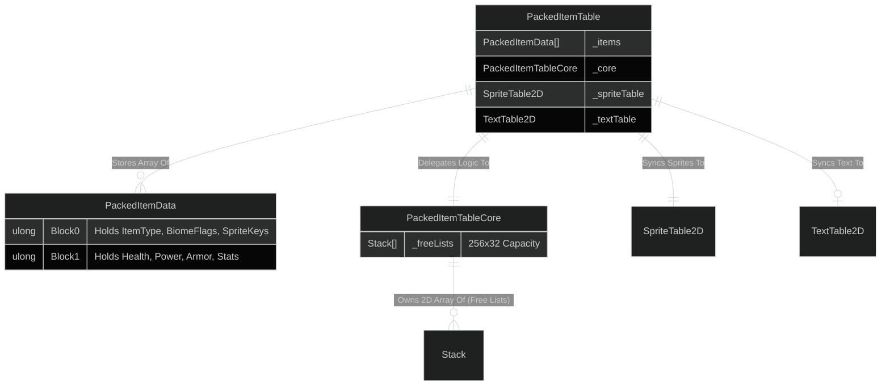

# PackedItemTable Entity-Relationship Diagram (ERD)

Mermaid natively supports Entity-Relationship Diagrams (ERDs)! These are fantastic for mapping out how different systems and classes communicate with each other and what fields they consist of.

Here is an ERD showing how your `PackedItemTable` manages its sub-systems and data structs:

### Relationship Notation Key:
* `||--||` : One-to-One 
* `||--o|` : One-to-Zero-or-One (Optional)
* `||--o{` : One-to-Zero-or-Many (Array / List / Collections)
